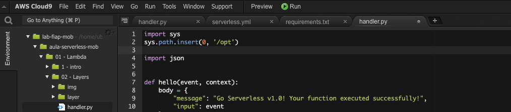
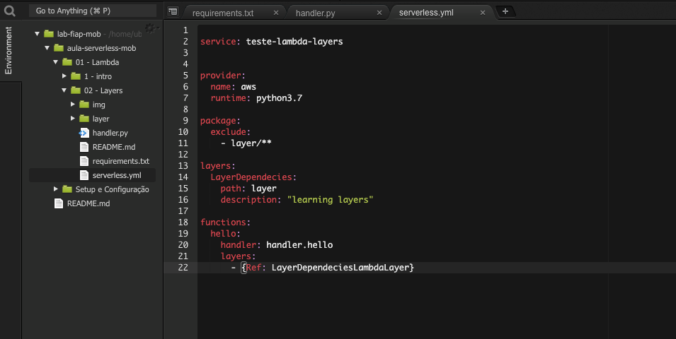
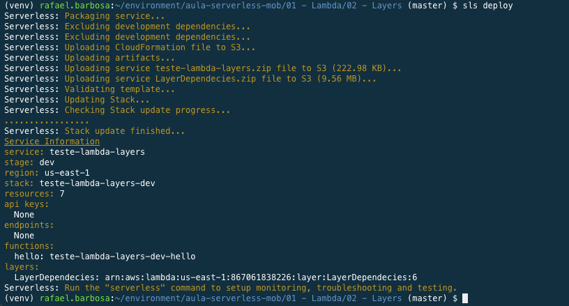

# Aula 01.2 - Lambda Layers

 1. Iniciar o repositório de trabalho `sls create --template "aws-python3"`
 2. Crie um arquivo chamado requirements.txt com o conteúdo 'boto3'
 3. Crie uma pasta chamada `layer`
 4. Execute o comando `pip3 install -r requirements.txt -t layer`
 5. No arquivo handler.py, deixe o topo do arquivo como na imagem. 
 
 6. No serverless.yml deixe o arquivo como na imagem: 
   
 7. Fazer deploy da função criada `sls deploy` 
 8.  Testar remotamente a função `sls invoke -f hello`

 9. destrua a função feita `sls remove`

