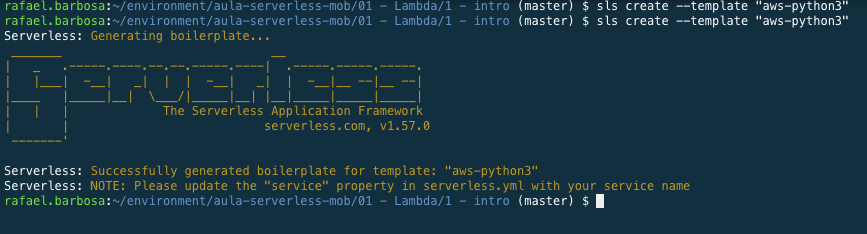
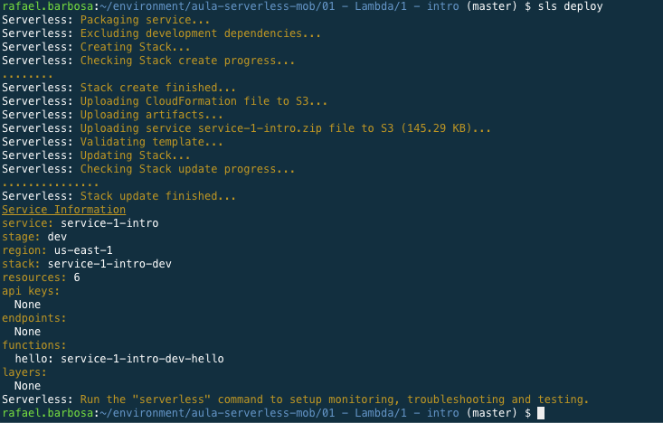
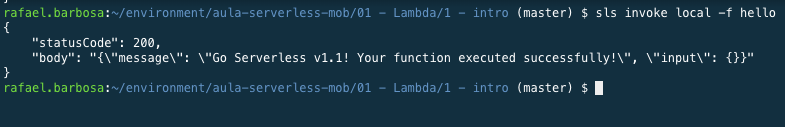

# Aula 01 - Lambda

 1. Instalar serverless framework `npm install -g serverless`
 2. Iniciar o repositório de trabalho `sls create --template "aws-python3"`
 

 3. Fazer deploy da função crada `sls deploy`
 

 4. Testar remotamente a função `sls invoke -f hello`

 5. Altere a versão do retorno da função para 1.1
 6. Faça um teste local da sua função `sls invoke local -f hello` 

 7. destrua a função feita `sls remove`
