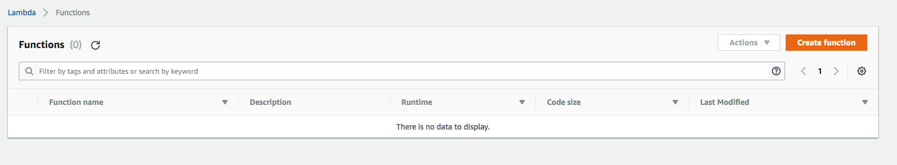
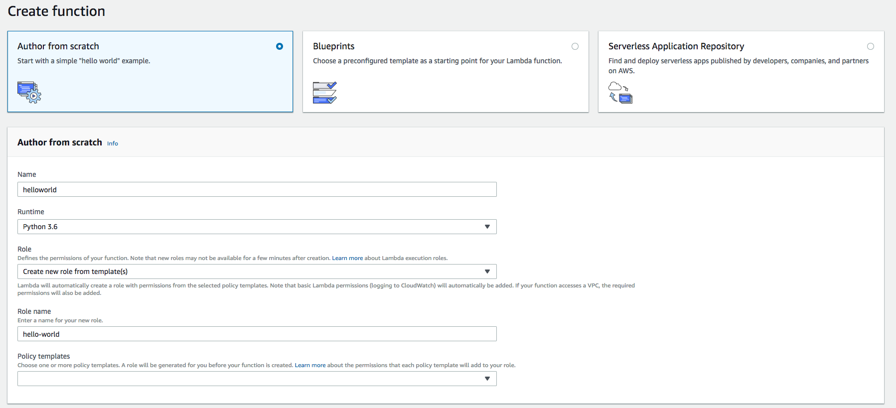
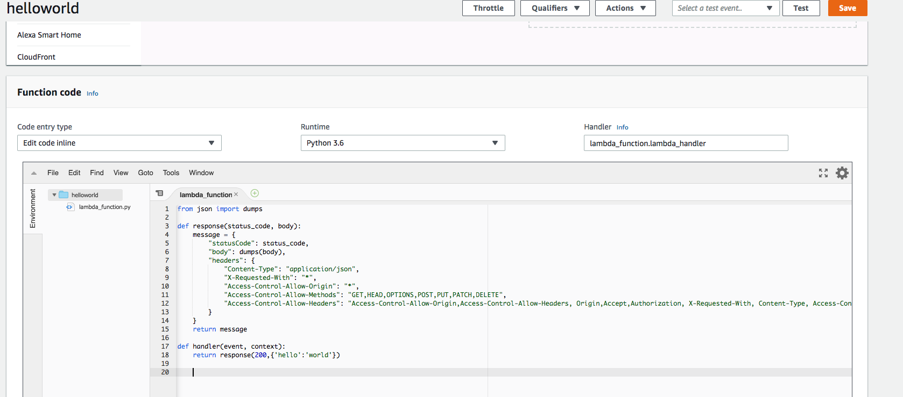
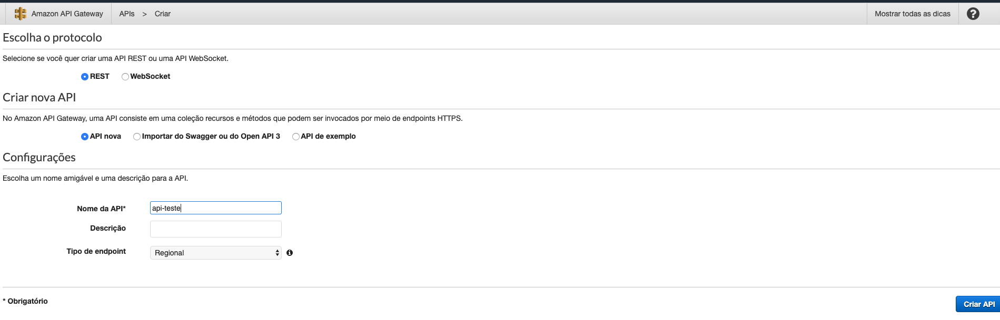
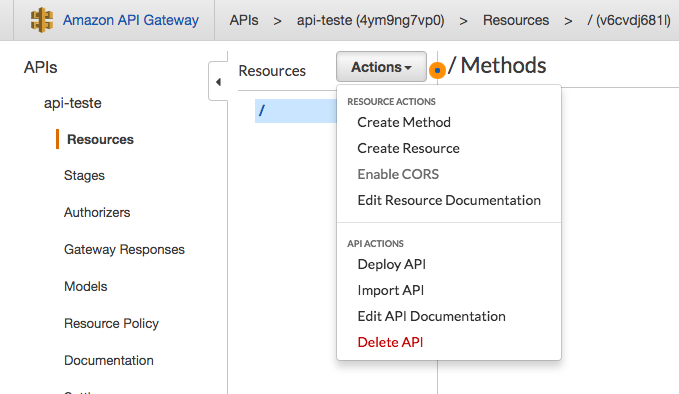
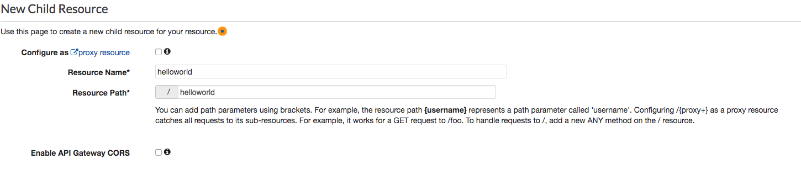
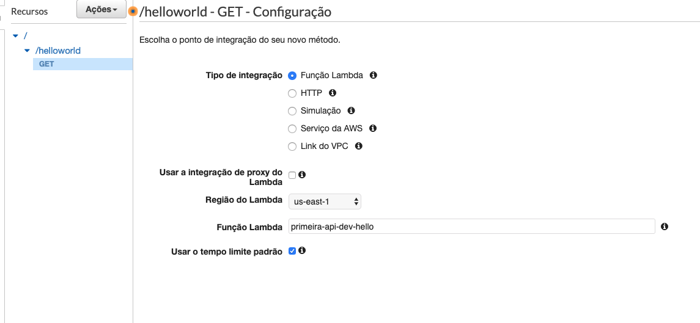
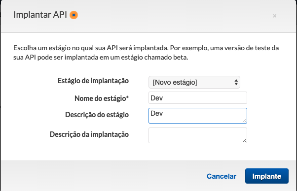
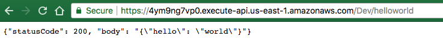

# Aula 02.1 - Primeira api com lambda

### Criando o lambda

1. Na pagina princial do serviço Lambda, clique em 'Create Function'

2. Preencha com as informações pedidas

3. copie o conteudo do arquivo lambda.py e cole no editor da função

4. Clique em 'Save' no topo da página

### Criando a api
1. Selecione 'new api' e coloque o nome:

2. Clique em 'actions' e depois em 'Create Reource'

3. Preencha o formulario e clique no botão 'Create Resource'

4. Clique em 'Actions' e deplois em 'Create Method' e selecione o metodo get

5. Preencha os parametros conforme a imagem, após clique em save

6. Clique em 'Actions' e selecione 'Deploy API'
7. Em 'Deployment Stage' selecione '[New Stage]', preencha o que é pedido, e clique em 'Deploy'

8. Para testar é só utilizar a url que foi fornecida e adcionar /helloworld no navegador

