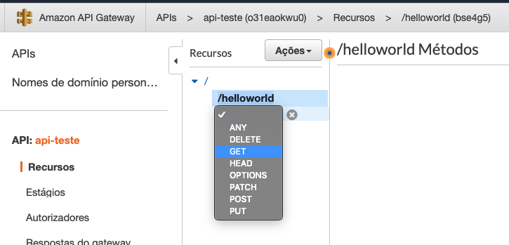

# Aula 02.1 - Primeira api com lambda

### Criando o lambda

1. No terminal do IDE criado no cloud9 execute o comando `cd ~/environment/aula-serverless-mob/02\ -\ Api\ Gateway/01\ -\ Primeira\ api/` para entrar na pasta que fara este exercicio.
2. Utilize o IDE para explorar os arquivos handler.py e serverless.yml que constam nessa pasta, eles serão utilizados para criar o lambda da api que vamos utilizar.
3. No terminal utilize o comando `sls deploy` para fazer deploy da função lambda

### Criando a api
1. Em uma nova aba, abra o console da AWS e va para o serviço `Api Gateway`
2. Clique em `Comece agora`
   
3. Selecione 'nova api' e coloque o nome `api-teste` em seguida clique em `criar api`:

4. Clique em 'ações' e depois em 'Criar Recurso', no nome do Recurso apenas digite `helloworld`, assim como em caminho do recurso e clique em `criar recurso` no canto inferior direito.

5. Clique em 'ações' e deplois em 'Criar método' e selecione o metodo get e crie.

6. Preencha os parametros conforme a imagem, após clique em Salvar

7. Clique em 'Ações' e selecione 'Implantar API'
8. Em 'Deployment Stage' selecione '[Novo Estágio]', preencha o que é pedido, e clique em 'Implante'

9. Para testar é só utilizar a url que foi fornecida e adcionar /helloworld ao final no navegador como na imagem abaixo

