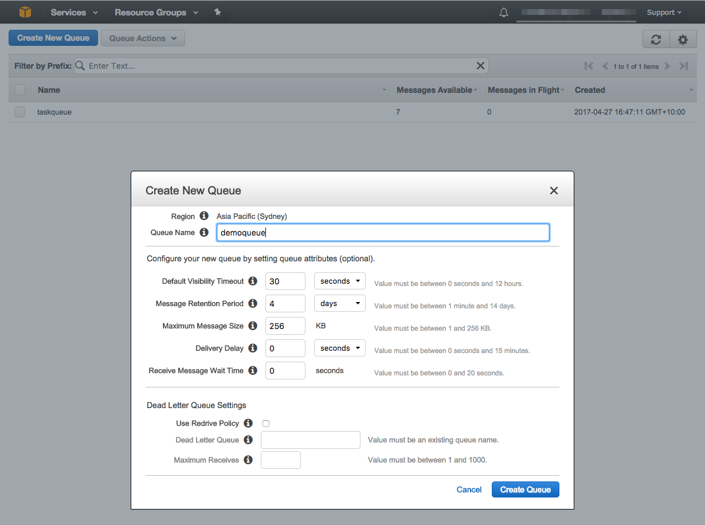
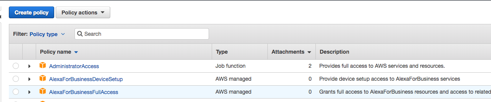

# Aula 02.3 - Service Proxy

### Criando a fila sqs
1. Crie uma fila no sqs colocando o nomme 'demoqueue', deixe os valores default e clique em 'Create Queue'

2. Copie o ARN da sua fila. É a terceira informação da sua aba 'Details' quando a fila esta selecionada.
### Criando a Role do Api Gateway
3. Abra outra aba e vá para o menu de IAM. Clique em 'Policies' no menu ao lado esquerdo
4. Clique em 'Create policie'

5. Na aba 'JSON' preencha com o sequinte código, trocando 'sqs-arn' pelo arn da fila que criou. E clique em 'Review Policy'
```

{
    "Version": "2012-10-17",
    "Statement": [
        {
            "Effect": "Allow",
            "Resource": [
                "sqs-arn"
            ],
            "Action": [
                "sqs:SendMessage",
                "sqs:ReceiveMessage"
            ]
        }
    ]
}
```
6. Nomeie a Policy e clique em 'Create policy'

7. Agora vamos criar a role para o apigateway, clique na opção 'Roles' no meu esquerdo
8. Clique em 'Create role'
9. Selecione 'Api Gateway' em clique em 'Next: Permissions'

10. clique em 'Next: Review'
11. De o nome 'demoqueue-apigateway-proxy' e clique em 'create'
12. Clique na role que acabou de criar
13. Clique em 'Attach policy'

14. Procure pela policy que criou, selecione, e clique em 'Attach policy'

15. A role tem que ficar como na imagem


### Criando os recursos no Api Gateway

16. Crie um recurso chamado 'demoqueue'
17. No recurso 'demoqueue' crie outro chamado 'send'

18. No recurso 'send' crie um método do tipo 'GET'
19. Preencha com os dados como a imagem, não esquece de pegar o arn da role que criou, depois clique em 'Save'

20. Clique em 'Method Request'

21. Deixe as query Strings como na imagem, salve, e volte a tela a anterior
 
22. Clique me 'Integration Request'
23. Deixe o Query String como na imagem abaixo, salve e volte a tela anterior

24. Faça o deploy da aplicação o stage já criado.
25. Teste sua api, quando chamar o path /demoqueue/send?MessageBody=SuaMensagem, você deve receber código 200 de resposta juntamente com um json. Se olhar em sua fila sqs verá que tem um item como na imagem.

