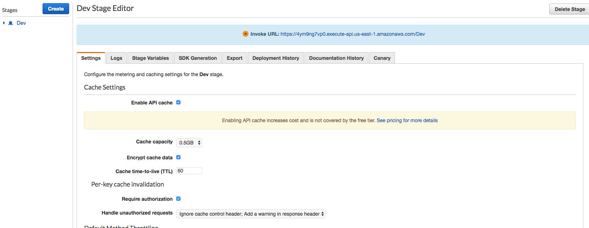
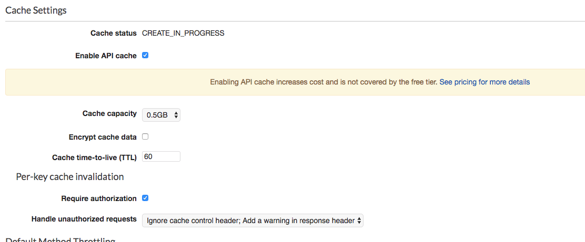
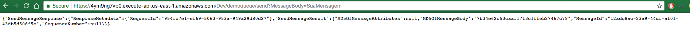
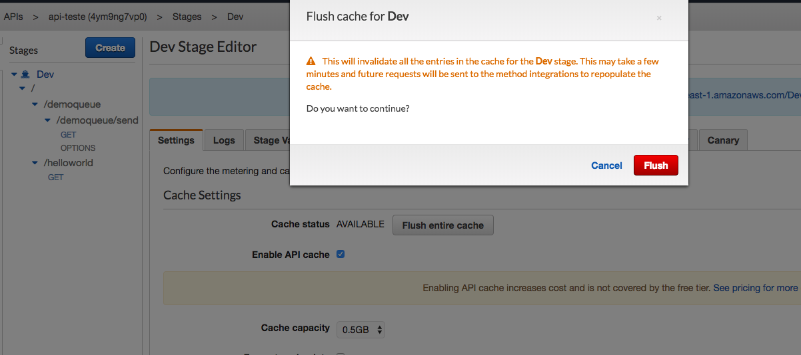
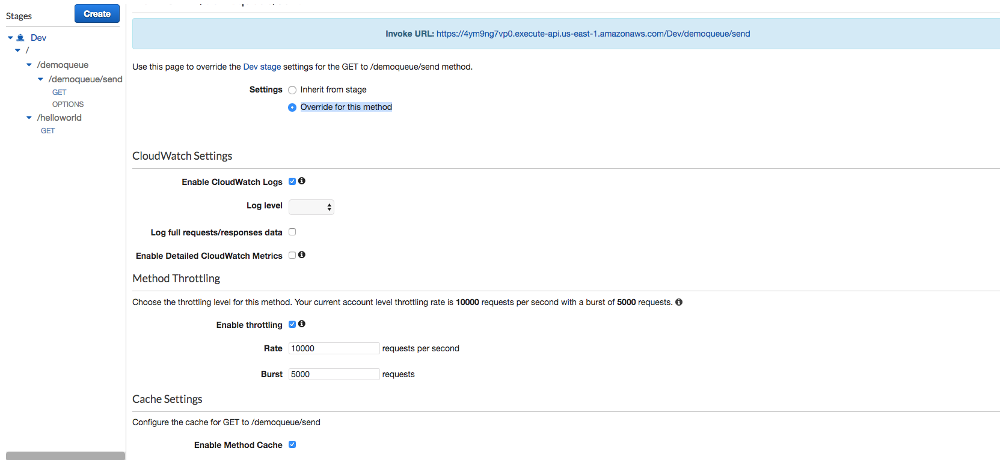

# Aula 02.4 - Cache API

1. Na api criada no capitulo anterior vá em stages e selecione o que fez o ultimo deploy
2. Clique em 'Enable API cache'

3. Coloque '0.5GB' em 'Cache capacity'
4. Coloque '60' em Cache time-to-live (TTL)
5. Clique em 'Save Changes' no final da pagina e aparecerá 'Create in Progress' no lugar do cache da api, este processo leva alguns minutos até terminar em aparecer 'AVAILABLE'.

6. Teste a api de envio de mensagem para o sqs
7. Caso tudo esteja correto, na primeira chamada ira inserir um objeto na fila, da segunda em diante vai apenas lhe devolver a resposta igual a primeira, você consegue notar isso pelo atributo 'MessageId' da resposta.

8. De um flush no cache e teste novamante.

9. Como esse comportamento não é o esperado, desabilite o cache para essa chamada em especifico. Para isso va até o recurso desejado, e selecione o método 'GET' dentro dele.
10. selecione 'Override for this method' para abrir opções manuais.

11. Desabilite a opção 'Enable Method Cache' e 'Enable CloudWatch Logs'. Clique em 'Save Changes'.
12. Faça novamante o fluxo do cache.
13. Agora cada vez que fizer a chamada desse caminho da API, obrigatóriamente irá chegar no lambda para inserir algo no banco.

