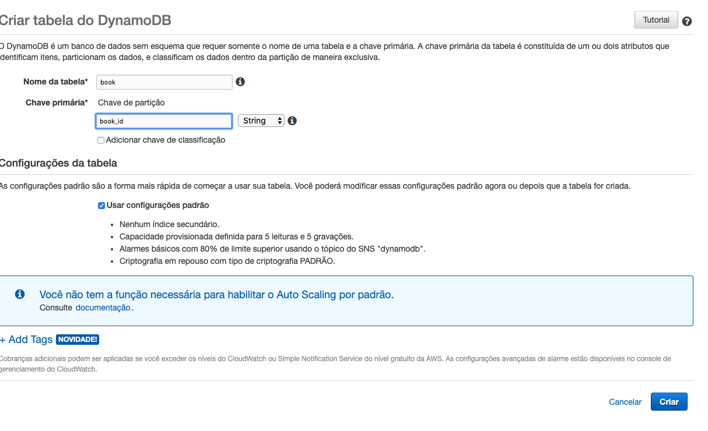

# 03.1 - Partition key

1. No terminal do IDE criado no cloud9 execute o comando `cd ~/environment/aula-serverless-mob/03\ -\ Dynamo/01\ -\ Partition\ Key/` para entrar na pasta que fara este exercicio.
2. Execute o comando `pip3 install boto3` no terminal para instalar as dependências necessárias para exercicio
3. Em uma nova aba abra o console da AWS e vá para o serviço DynamoDB.
4. Clique em Criar Tabela no painel do dynamoDB

5. Preencha os dados como na imagem e clique em Criar

6. A tabela pode levar alguns minutos para ser criada
7. Modifique o arquivo 'dynamo.py' utilizando o IDE para que fique como na imagem

8. Para executar o arquivo utilize no terminal o seguinte `python3 dynamo.py`
9. Se voltar a pagina do dynamoDB e atualizar a aba itens verá que temos apenas um registro. Isso ocorreu porque quando inserirmos partition keys identicas o banco sobrescreve o registro anterior.

10. Altere o arquivo 'dynamo.py' para que as partition keys fiquem diferentes

12. execute novamente o arquivo `python3 dynamo.py`
13. Agora a tabela book tem 3 registros, cada um com seu atributo
