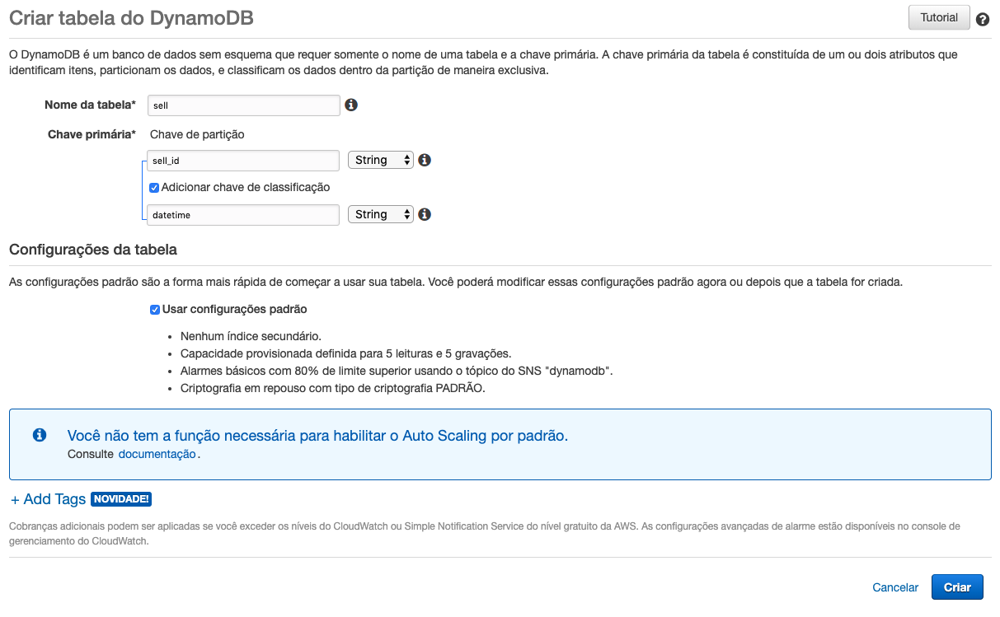
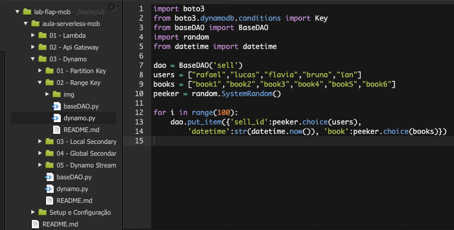
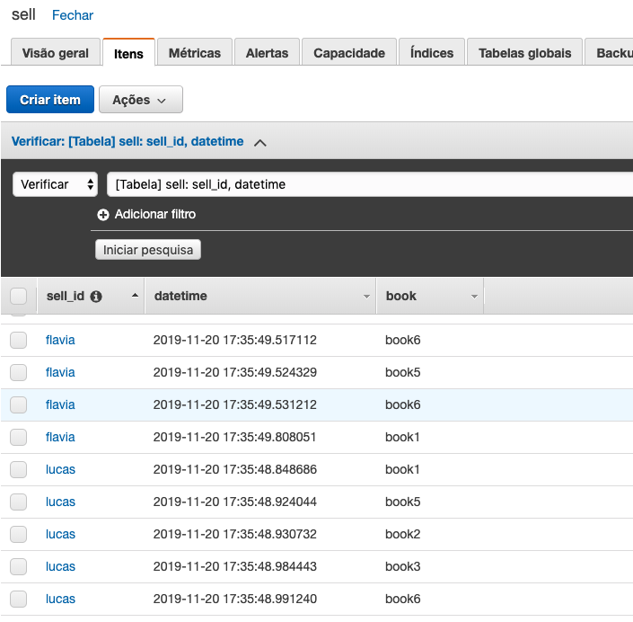
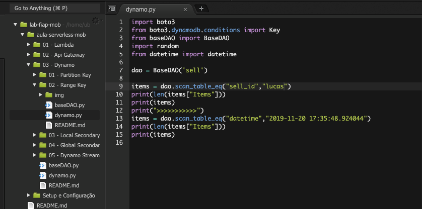
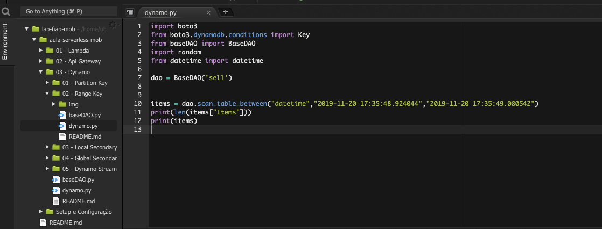
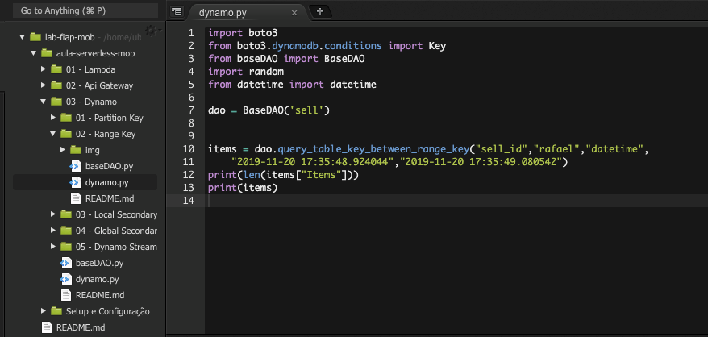
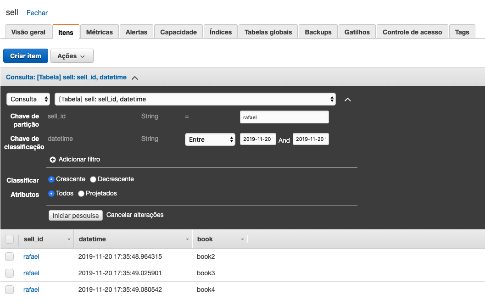

# 03.2 - Range Key

1. No terminal do IDE criado no cloud9 execute o comando `cd ~/environment/aula-serverless-mob/03\ -\ Dynamo/02\ -\ Range\ Key/` para entrar na pasta que fara este exercicio.
2. Em uma nova aba abra o console da AWS e vá para o serviço DynamoDB.
3. Clique em 'Criar Tabela'
4. Preencha os dados como na imagem e clique em 'Criar'

3. Altere o arquivo 'dynamo.py' para ficar como na imagem 

4. Execute o arquivo com o comando `python3 dynamo.py` no terminal
5. Agora sua tabela estará populada com diversos objetos

6. Escolha um dos datetimes e um dos nomes que constam na sua tabela sell e altere novamente o arquivo 'dynamoDB' para que fique como na imagem

7. Execute o arquivo com `python3 dynamo.py`
8. Faça testes trocando o nome que esta sendo utilizado com o sell_id por outros da lista e veja os resultados executando `python3 dynamo.py`.
9. Escolha um intervalo de um segundo em sua tabela e deixe seu arquivo 'dynamo.py' como na imagem

9. Execute o arquivo com `python3 dynamo.py`
10. Escolha um nome e um intervalo de tempo que tenha registros e altere o arquivo 'dynamo.py' como na imagem

11. No painel do dynamoDB vá até a aba 'Items' e execute uma query como a que fez utilizando python, porem adicionando book como filtro

