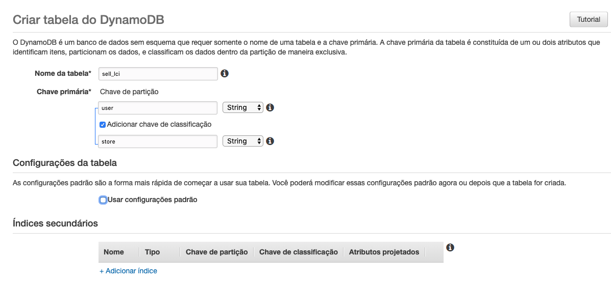
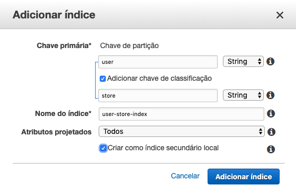
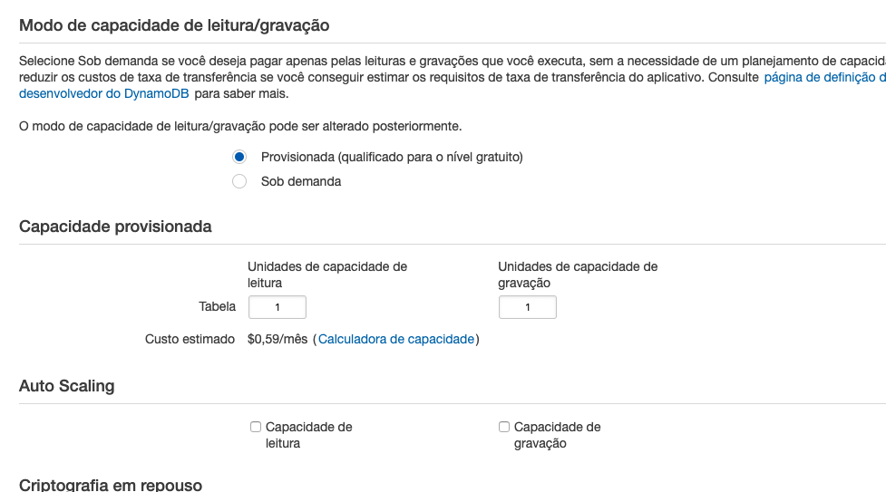
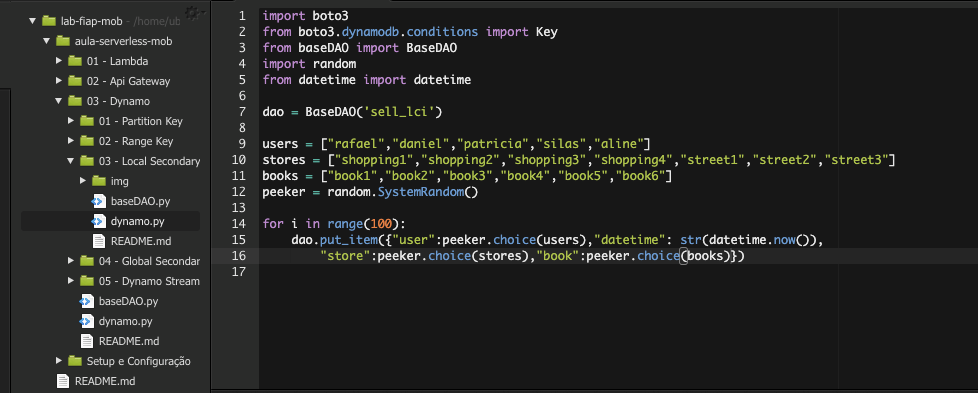
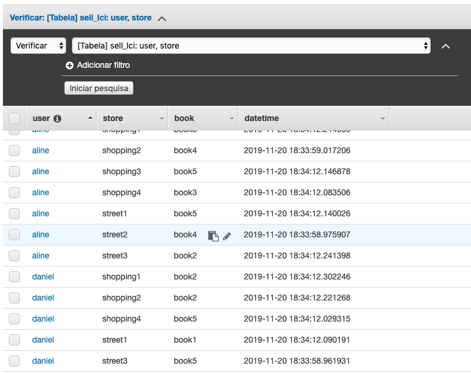
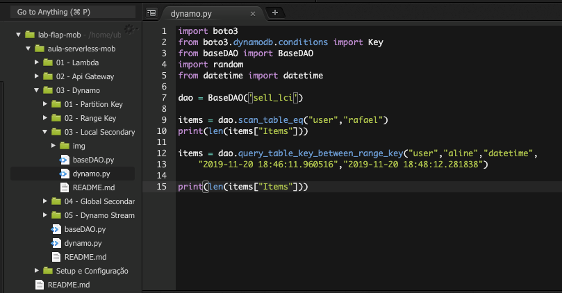
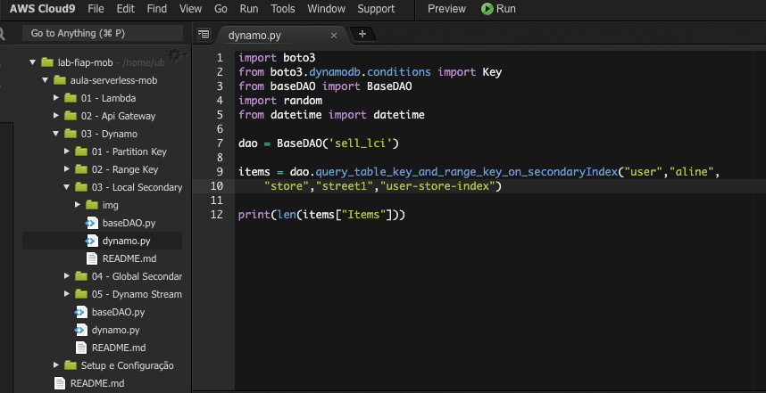

# 03.3 - Local Secondary Key

1. No terminal do IDE criado no cloud9 execute o comando `cd ~/environment/aula-serverless-mob/03\ -\ Dynamo/03\ -\ Local\ Secondary\ Key/` para entrar na pasta que fara este exercicio.
2. Em uma nova aba abra o console da AWS e vá para o serviço DynamoDB.
3. Clique em 'Criar Tabela'e preencha o formulário como na imagem, após desabilite a opção 'Usar configurações padrão' e clique em 'Adicionar indice'

4. Preencha o popup que abriu como na imagem e clique em 'Adicionar Índice':
   
5. Desmarque as opções de Auto Scalling e deixe o 'Capacidade provisionada' como na imagem, e clique em 'Criar'

6. Altere o arquivo 'dynamo.py' para inserir registros na tabela criada como na imagem
 
7. Execute o arquivo com o comando `python3 dynamo.py` no terminal

8. Escolha um usuario e um range de um segundo para executar o arquivo 'dynamo.py' como no exemplo

9. execute o comando `python3 dynamo.db`
10. Escolha uma store e altere o arquivo 'dynamo.py'

11. Execute o comando `python3 dynamo.py`
    