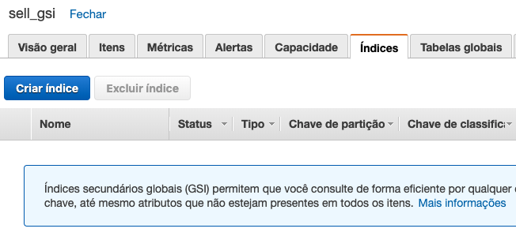
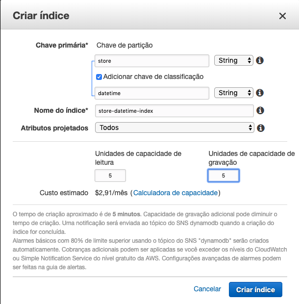
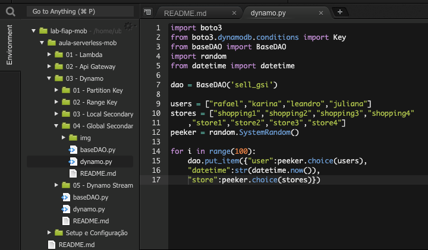
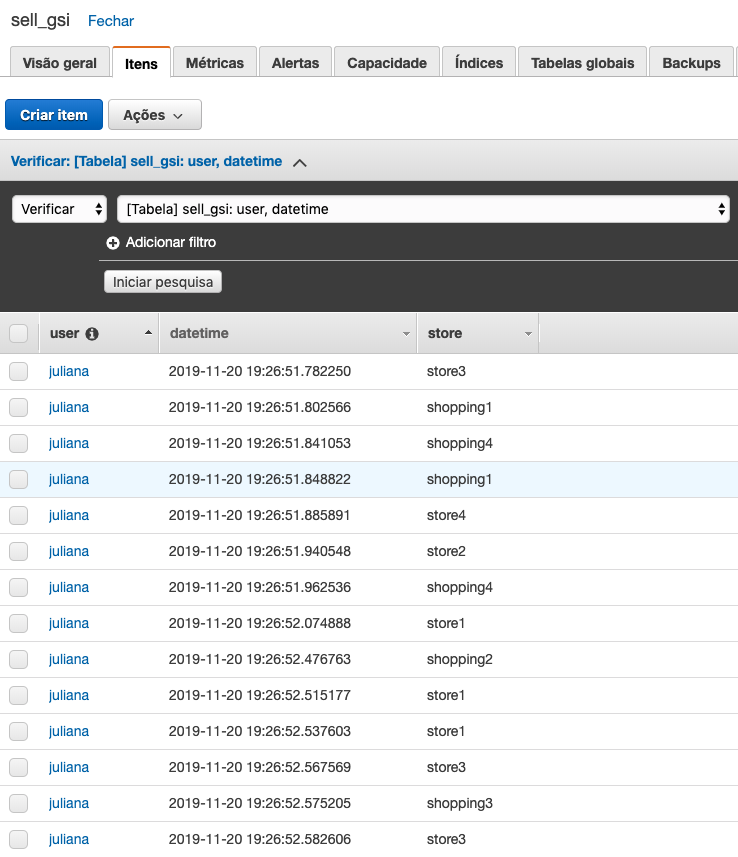
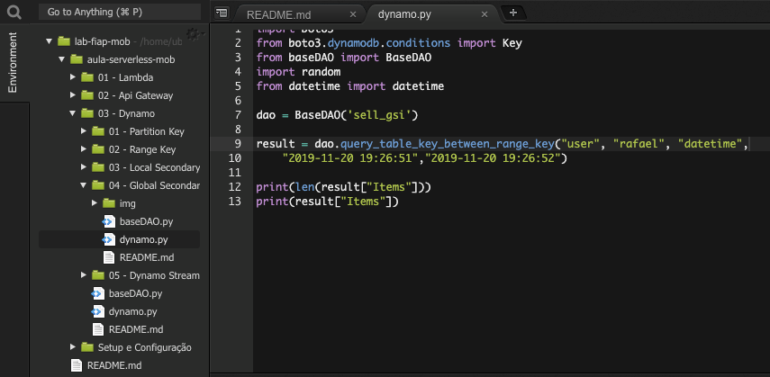
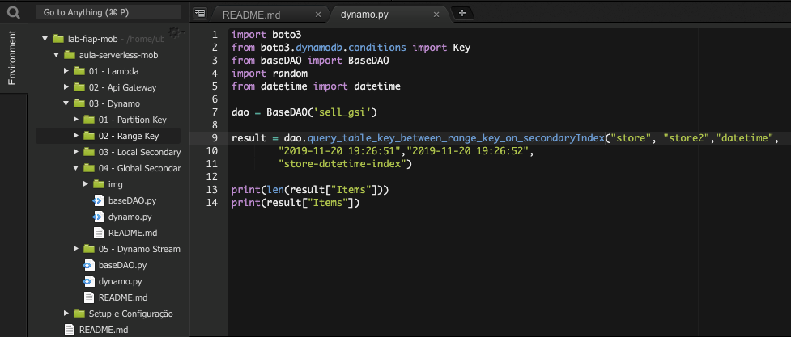

# 03.4 - Global Secondary Key

1. No terminal do IDE criado no cloud9 execute o comando `cd ~/environment/aula-serverless-mob/03\ -\ Dynamo/04\ -\ Global\ Secondary\ Key/` para entrar na pasta que fara este exercicio.
2. Em uma nova aba abra o console da AWS e vá para o serviço DynamoDB. 
3. Dessa vez vamos criar uma tabela chamada 'sell_gsi' com as configurações da imagem abaixo:
   
4. Após a finalização de criação da tabela vá até a aba 'Indices', e clique em 'Criar Índice'.

5. Preencha como a imagem, e clique em 'Criar Índice'. Esse processo pode demorar.

6. Altere o arquivo 'dynamo.py' para que fique como na foto

7. Execute o arquivo com o comando `python3 dynamo.py`

8. Altere o arquivo 'dynamo.py' para que fique como na foto, escolhendo um invervalo valido de um segundo para o usuario pesquisado

9. Execute o arquivo com o comando `python3 dynamo.py`
10. Altere o arquivo 'dynamo.py' para que fique como na foto, escolhendo um invervalo valido de um segundo para a loja pesquisado

11. Execute o arquivo com o comando `python3 dynamo.py`
