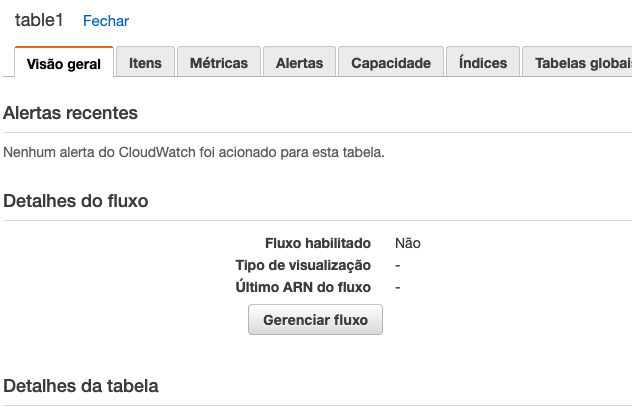
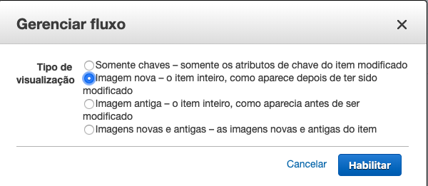
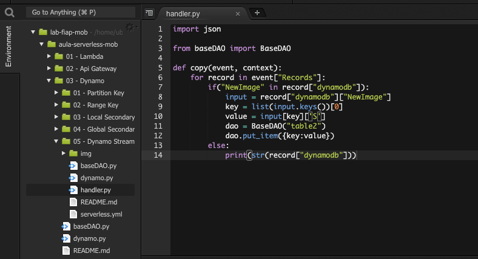
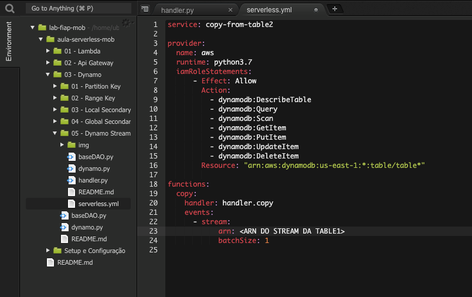
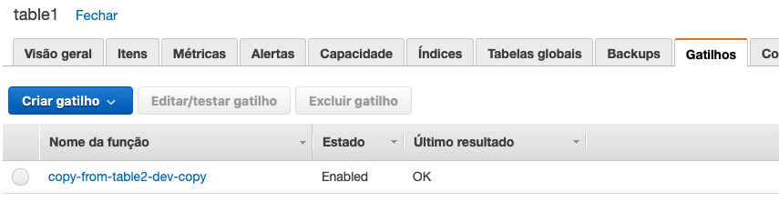

# 03.5 - Dynamo Streams

1. No terminal do IDE criado no cloud9 execute o comando `cd ~/environment/aula-serverless-mob/03\ -\ Dynamo/05\ -\ Dynamo\ Streams/` para entrar na pasta que fara este exercicio.
2. Em uma nova aba abra o console da AWS e vá para o serviço DynamoDB. 
3. Crie 2 tabelas simples, table1, e table2 com a mesma chave de partição 'user'.
4. Na table1, na aba 'Visão geral', clique em 'gerenciar fluxo'

3. Escolha a opção 'Imagem nova', e clique em 'Habilitar'

1. rode o comando `sls create --template "aws-python3"`
2. Edite o arquivo 'handler.py' para que fique como na imagem

8. Edite o arquivo 'serverless.yml' para que fique igual na imagem

1. Execute o comando `sls deploy` no terminal
2.  Verifique no painel da 'table1' se existe um gatilho atribuido ao Stream
 
12. Altere o arquivo 'dynamo.py' na raiz do módulo para inserir 10 linhas na 'table1'
13. Em outra aba do terminal rode o arquivo 'dynamo.py' com o comando `python3 dynamo.py` dentro da pasta citada no passo 1 deste exercicio
14. execute o seguinte comando para seguir o log da função criada `sls logs -t -f copy` 
15. Caso tudo tenha dado certo todos as linhas inseridas na 'table1' também vão estar na 'table2'
