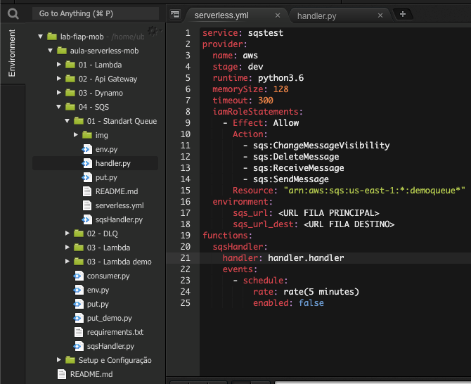
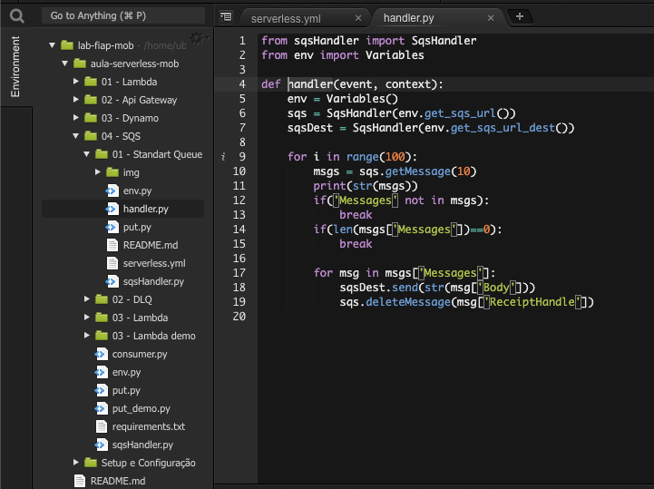
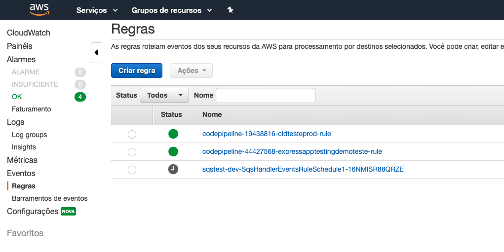
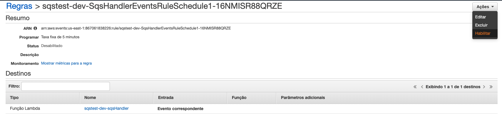
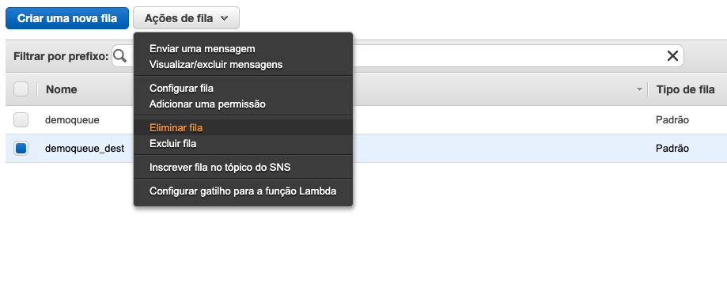

# Aula 04.1 - Standart Queue

### Criando a fila sqs
1. Crie uma fila no sqs colocando o nome 'demoqueue', deixe os valores default e clique em 'Criar Fila'

2. Copie o ARN da sua fila. É a terceira informação da sua aba 'Detalhes' quando a fila esta selecionada.
### Enviando dados para a fila
1. 

### Consumindo SQS 

1. Cria mais uma fila sqs com o mesmo nome da anterior com o sulfixo '_dest'
2. Crie uma pasta chamada 'lambda'
3. Entre na pasta 'lambda'
4. Crie um arquivo 'serverless.yml' e coloque o seguinte conteudo:

5. copie os arquivos 'env.py' e 'sqsHandler.py' que estão na raiz do módulo SQS para o diretório 'lambda'
6. No diretório lambda crie um arquivo 'lambda.py' com o seguinte conteudo

7. rode o comando `sls deploy`
8. Coloque alguns itens na fila, lembrando que cada execução do lambda criado pode consumir até 1000 posições da fila sqs.
9. Para execução do lambda rode o comando `sls invoke -l -f sqsHandler`
10. Caso queira ver os arquivos sendo consumidos da fila automaticamente a cada 5 minutos a regra criado com o serverless precisa ser ativada. Para isso vá ao console do cloudwatch events. Clique em  'Rules' na barra da esquerda.

11. Clique na regra que foi criada pelo servlerless, então, no cato superior direito clique em 'Actions' e selecione 'Enable'

12. Na pasta lambda rode o comando `sls remove` para remover o que foi criado.
13. Vá até o painel do sqs, selecione as 2 filas que utilizou no exercicio, clique em 'Queue Actions' e depois em 'Purge Queues'. Confirme.

