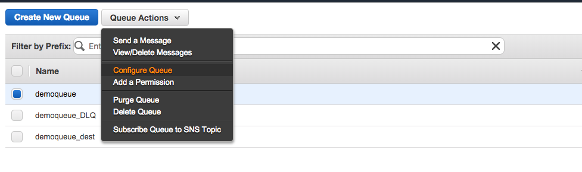
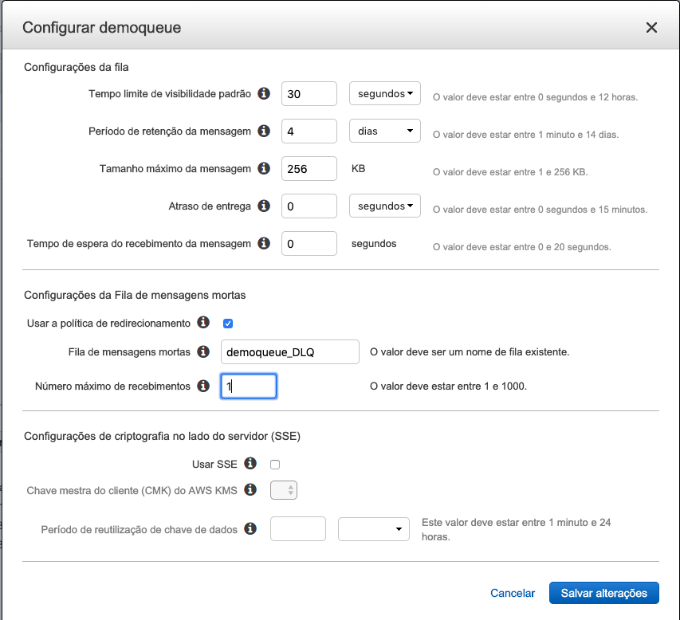
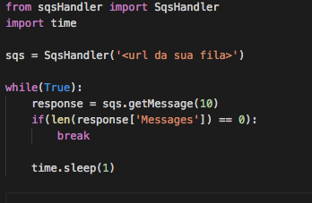

# Aula 04.2 - DLQ Queue

1. No terminal do IDE criado no cloud9 execute o comando `cd ~/environment/aula-serverless-mob/04\ -\ SQS/02\ -\ DLQ/` para entrar na pasta que fara este exercicio.
2. Na aba do SQS crie uma fila com o mesmo nome de uma fila já criada e coloque o sulfixo '_DLQ'
3. Selecione a fila Demoqueue clique em 'Ações  fila' e depois em 'Configurar fila'

3. Preencha as informações como na imagem, e clique me 'Salvar alterações'

1. Coloque a url da sua fila no lugar descrito no arquivo 'put.py'
2. execute o comando `python3 put.py`
3. Copie o arquivo 'consumer.py' que esta na raiz do módulo para dentro da pasta 'sqs' e faça as alterações como na imagem.

9. execute o comando `python3 consumer.py`
10. Observe que enquanto roda o script a fila DLQ é populada.

