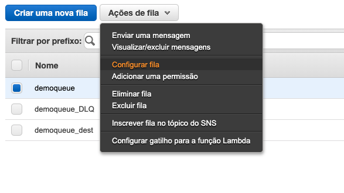
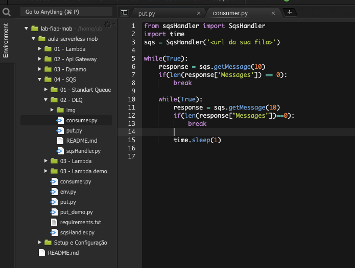

# Aula 04.2 - DLQ Queue

1. Crie uma fila com o mesmo nome de uma fila já criada e coloque o sulfixo '_DLQ'
2. Selecione a fila que já existia clique em 'Queue Actions' e depois em 'Configure Queue'

3. Preencha as informações como na imagem, e clique me 'Save Changes'

4. Crie uma pasta chamada 'sqs' e entre nela
5. Copie o arquivo 'sqsHandler.py', e o 'put.py' que esta na raiz do módulo para dentro da pasta 'sqs'
6. Coloque a url da sua fila no lugar descrito no arquivo 'put.py'
7. execute o comando `python3 put.py`
8. Copie o arquivo 'consumer.py' que esta na raiz do módulo para dentro da pasta 'sqs' e faça as alterações como na imagem.

9. execute o comando `python3 consumer.py`
10. Observe que enquanto roda o script a fila DLQ é populada.

