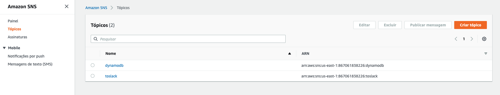
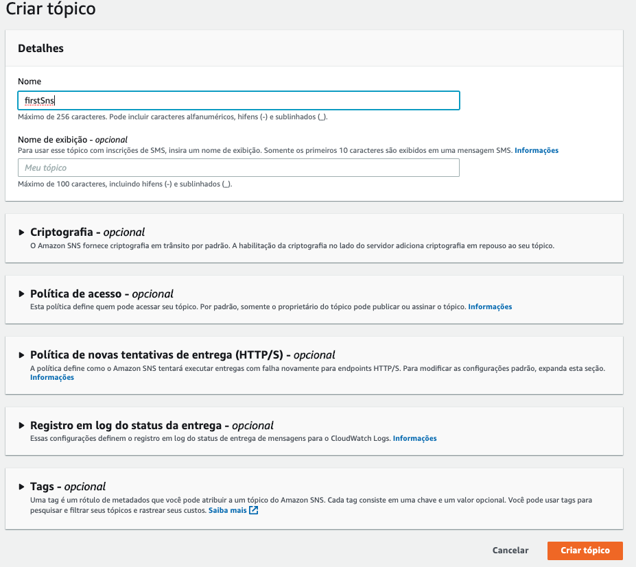
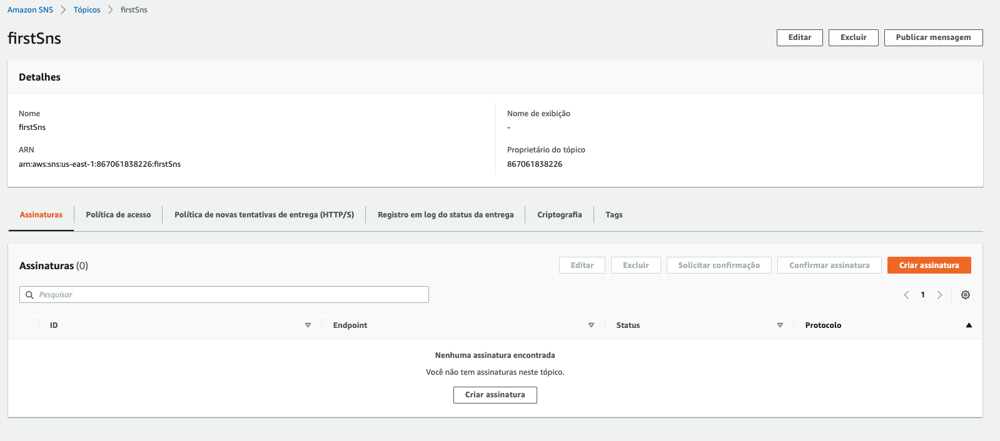
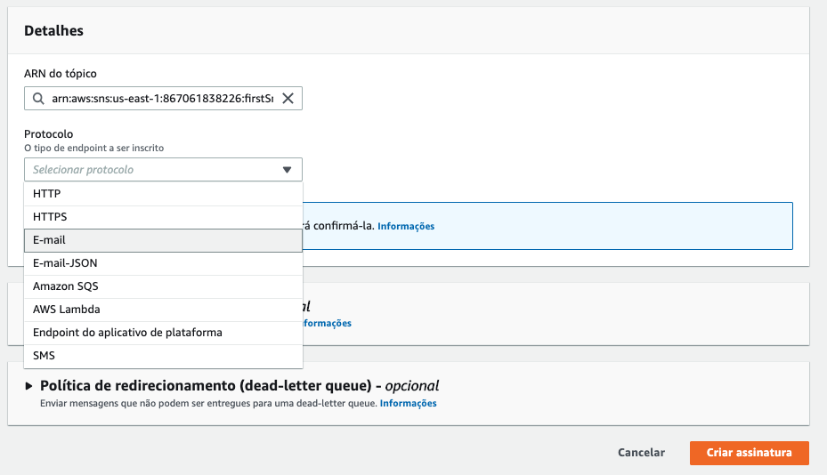
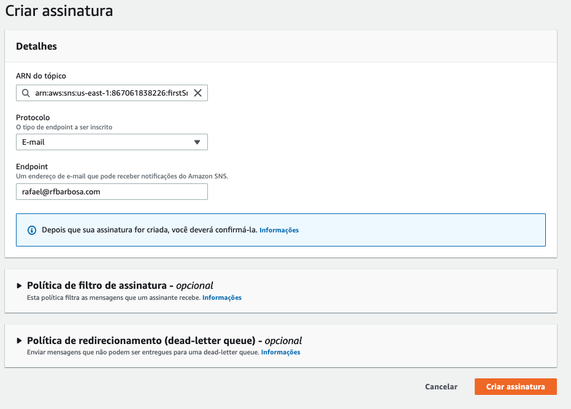
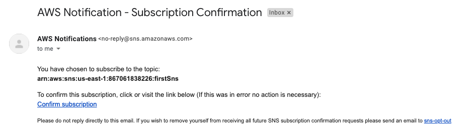
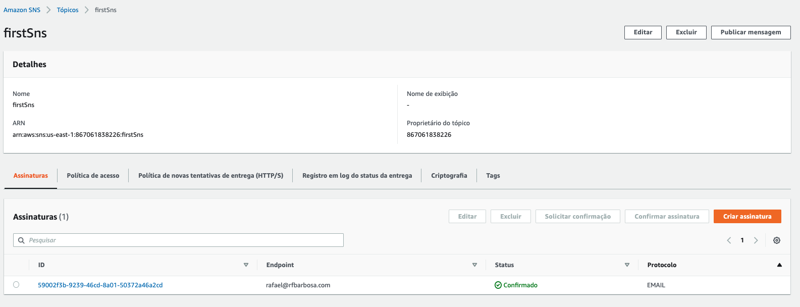

# Aula 05.1 - Email

1. Vá até o console do SNS e na aba Tópicos do menu clique em 'Criar tópico'

2. De o nome 'firstSns' ao tópico e clique em criar tópipo
   
3. Com o tópico criado clique em 'Criar Assinatura'

4. Em 'protocol' selecione 'Email' e em 'Endpoind' coloque o email que deseja receber a notificação, e clique em 'Create subscription'

5. Você irá receber um email pedindo confirmação de subscrição no email cadastrado, clique em 'Confirm Subscription'

6. Voltando ao painel do seu tópico clique em 'Publicar Mensagem'
   
7. Preencha os campos como na imagem e clique em 'Publicar Mensagem'

8. Cheque seu email para o recebimento da notificação