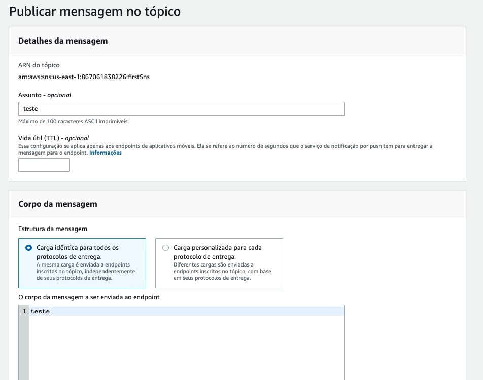

# Aula 05.1 - Email

1. Vá até o console do SNS e clique em 'Create topic'

2. De o nome 'firstSns' ao tópico
3. Com o tópico criado clique em 'Create subscription'

4. Em 'protocol' selecione 'Email' e em 'Endpoind' coloque o email que deseja receber a notificação, e clique em 'Create subscription'

5. Você irá receber um email pedindo confirmação de subscrição no email cadastrado, clique em 'Confirm Subscription'

6. Voltando ao painel do seu tópico clique em 'Publish to topic'
7. Preencha os campos como na imagem e clique em 'Publish Message'

8. Cheque seu email para o recebimento da notificação