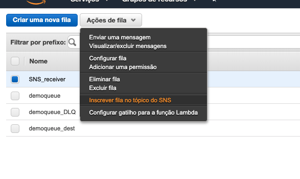
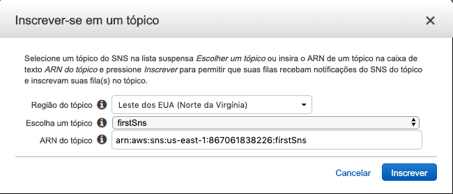

# Aula 05.2 - Proxy e SQS

### Proxy

1. Crie uma IAM policy com o nome 'publish_firstSns' com o seguinte conteudo
```
{
    "Version": "2012-10-17",
    "Statement": [
        {
            "Sid": "VisualEditor0",
            "Effect": "Allow",
            "Action": "sns:Publish",
            "Resource": "<ARN do seu SNS>"
        }
    ]
}
```
2. Crie uma IAM Role para api gateway e adicione a policy que acabou de criar após a criação da Role
3. No painel do API gateway, crie uma api e nela crie o recurso 'firstsns', e dentro dele crie o recurso 'send'
4. No recurso 'send' crie um metodo 'POST' e preencha os campos como na imagem


5. Clique no método 'POST' que acbaou de criar e depois clique em 'Integration Request'
6. Preencha o campo 'URL Query String Parameters' como na imagem

7. Faça o deploy da api

### SQS

8. Crie uma fila SQS(Caso já não tenha uma pronta dos exercicios anteriores)
9. Selecione a fila e clique em 'Queue Actions', depois clique em 'Subscribe Queue to SNS topic'.

10. Preencha o campo 'topic' escolhendo o mesmo que colocou no api gateway, como na imagem


### Testando

11. Envie um post com o seguinte formato json para a api criada
```
{
    "subject": "teste 1",
    "message":"teste proxy sns + sqs"
}
```
12. Você irá perceber que a cada chamada, um novo item é inserido no sqs


