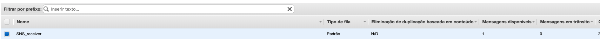

# Aula 05.2 -  SQS

### SQS

1. Crie uma fila SQS SNS_receiver
2. Selecione a fila e clique em 'Ações de fila', depois clique em 'Inscrever fila no topico SNS'.

3. Preencha o campo 'topic' escolhendo o mesmo que colocou no api gateway, como na imagem


### Testando

4. Em outra aba no painel do SNS vá ao topico firstSNS e publique uma mensagem como o exemplo
```
{
    "subject": "teste 1",
    "message":"teste sns + sqs"
}
```

5. Você irá perceber que a cada chamada, um novo item é inserido no sqs



