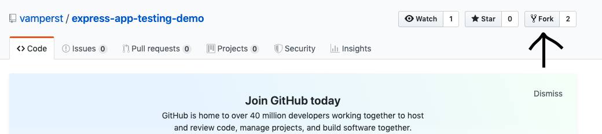

## Montar uma Integração continua com AWS CodePipeline e AWS CodeDeploy

1. Em uma conta AWS entre no serviço ECR
   
2. Clique em Create repository.
3. De o nome de express-app-testing-demo-img
   
4. Façam o Fork para a sua conta do github do repositório `https://github.com/vamperst/express-app-testing-demo` para ganhar liberdade nos testes e apontar o pipeline para o repositório na sua conta do github.
   
5. No terminal do IDE criado no cloud9 execute o comando `cd ~/environment/aula-serverless-mob/06\ -\ Code\ Pipeline\ \&\ Code\ Build/01\ -\ ecr/` para entrar na pasta que fara este exercicio.
6. No console AWS vá para o Serviço CodePipeline.
   
7. Clique em create pipeline
8.  De o Nome de express-app-testing-demo-ci
9.  Mantenha new service role selecionado e clique em next
    
10. No source escolha git e efetue o login na sua conta.
11. Deixe as opções como na imagem, foi para essa etapa que fez o fork do passo 4.
    
12. Na página seguinte escolha CodeBuild como provider.
13. Clique em create project
    
14. Na pagina que abrir coloque o nome do projeto 'express-app-testing-demo-build-image'
15. Em enviroment deixe como na imagem abaixo
    
16. Ainda em environment cliqie em 'Additional information' para extender o menu, você irá adicionar 2 variaveis de ambiente: ECR_ADDRESS, com o link do ECR que criou no passo 3, e PROJECT_NAME com o texto 'express-app-testing-demo-prod'
    
17. Em Buildspace apenas preencha com o nome do arquivo: 'buildspec.yml'
    
18. Clique em `continue do CodePipeline`ao final da página. Ele irá retornar a pagina do CodePipeline.
19. Clique em 'Next' na pagina do CodePipeline
    
20. Clique em 'skip Deploy stage'
21. Revise e clique em `Create pipeline`
22. A primeira vez que rodar vai falhar porque a role não esta com a permissão correta no codebiuld. Vá para a tela do IAM em Roles (Funções) e ache a role digitando o nome do projeto 'express-app-testing-demo-build-image'. Clique na função.
    
23. Clique em anexar politicas
24. Seleciona AdministratorAccess e anexe a politica
25. Volte ao CodePipeline e clique em 'Release Change' no canto superior direito
    
26. Você pode acompanhar os logs do build Clicando na fase quando ela estiver em andamento.
27. Após o termino você pode notar que os 2 estagios ficaram verdes e que tem uma nova imagem no repositório ECR.
    
    
    