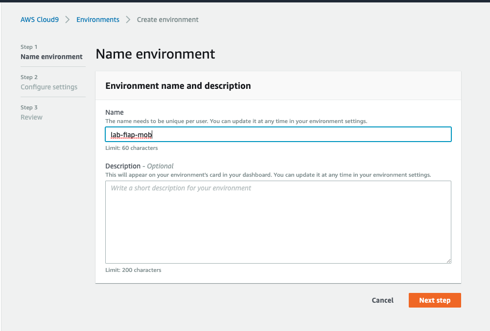

# Setup e Configuração de ambiente

 1. Abra o console da AWS e va para o serviço `Cloud 9`.
   
1. garanta que a região que esta utilizando é `us-east-1/ Norte da Virgínia`. Você consegue ver isso no canto superior direiro da tela.
    
 2. Clique em `create environment`.
 3. Coloque o nome `lab-fiap-mob` e avance.
 
 5. Deixe as configurações como na imagem a seguir:

 6. Caso os parametros estejam como na imagem a seguir clique em `Create Environment`
   
 7. A criação do ambiente pode levar alguns minutos.

 8. Após a criação clique em `abrir IDE`
   
9. Para os próximos comandos utilize o console bash que fica no canto inferior do seu IDE.
   
10. Execute o comando `npm install -g serverless` para instalar o serverless framework.
    
11. Execute o comando `git clone https://github.com/vamperst/aula-serverless-mob.git` para clonar o repositório com os exercicios.
    
    